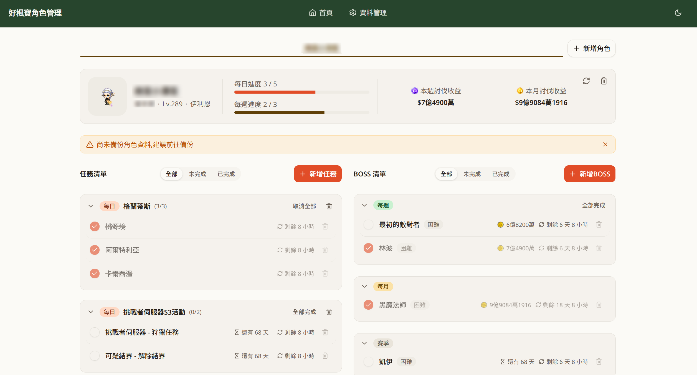

# MapleStory ToDoList

多角色的楓之谷每日/每週任務追蹤工具。同時經營多個角色時，用來管理每個角色各自的日常任務、BOSS討伐進度，並在重置時間到了之後自動清空勾選狀態。

https://mstodolist.vercel.app



## 技術棧

- **前端框架**：React 19 + TypeScript
- **建構工具**：Vite 8
- **狀態管理**：Zustand（含 persist 中間件）
- **UI 元件**：Radix UI、shadcn/ui
- **樣式**：Tailwind CSS 4
- **動畫**：Motion（Framer Motion）
- **部署**：Vercel（含 Serverless Function 代理外部 API）

## 功能

- **多角色管理**：可建立多個角色，各自獨立追蹤任務與 BOSS 進度，並可在角色間快速切換
- **支援期間活動**：根據台服官方改版更新活動任務範本及 BOSS，不只支援平時的每日任務及 BOSS，連活動也可支援
- **自定義任務**：可自定義建立任務追蹤，設定重置週期及截止日期，提供自定義任務的靈活性
- **角色查詢建立**：輸入角色名稱，透過官方 API 自動帶入伺服器、等級、職業與角色外觀圖，也可手動輸入
- **快速建立任務追蹤**：可套用預設任務範本（依角色等級自動判斷可選的地區/活動任務），或自訂任務，依 每日 / 每週 / 一次性 三種設定重置週期
- **BOSS 討伐追蹤**：勾選要追蹤的 BOSS 與難度，內建結晶收益參考值，畫面上顯示本日/本週/本月預估收益
- **自動重置**：依角色設定的每日重置時間、每週重置星期，定期自動重置已勾選的任務與 BOSS 攻略狀態
- **資料備份**：可將所有角色資料匯出成檔案，或透過 Google 帳號登入備份到自己的 Google Drive；可透過備份在不同裝置上管理紀錄

## 專案重點

- **不儲存任何敏感資料**：角色查詢僅讀取官方 API 提供的公開角色資訊，不會要求及儲存任何帳號密碼等等敏感資料
- **重置週期判斷邏輯**：依全域設定的每日/每週重置時間點，判斷任務與 BOSS 狀態是否該重置
- **Google Drive 增量備份**：偵測本地資料異動才觸發備份，並處理本地與雲端資料的合併邏輯，避免多裝置同步時互相覆蓋
- **使用 Serverless Function**：Nexon Open API 由 Vercel Serverless Function 代理請求，無後端資料儲存

## 開發須知

安裝依賴：

```bash
pnpm install
```

首次執行需連結到 Vercel 專案（登入帳號並選擇/建立對應專案）：

```bash
vercel link
```

啟動開發伺服器（含 `/api` Serverless Function，角色查詢功能需要）：

```bash
vercel dev
```

提交前建議依序執行以下檢查：

```bash
pnpm run lint
pnpm run typecheck
pnpm run build
```

需要 Node.js 20 以上版本。

需要在專案根目錄建立 `.env.local`，並設定以下環境變數：

```
VITE_GOOGLE_CLIENT_ID=你的 Google OAuth Client ID
```

`NEXON_API_KEY`（角色查詢功能用）是 `api/nexon-character.ts` 這支 Vercel Serverless Function 專用的環境變數，設定在 Vercel 專案後台；本機執行 `vercel link` 連結專案後，`vercel dev` 會自動讀取該變數。

© 2026 Daniel.  
MapleStoryTodolist is an unofficial fan-made website for MapleStory. Unauthorized copying, modification, or distribution is prohibited. All game assets and trademarks belong to their respective owners.